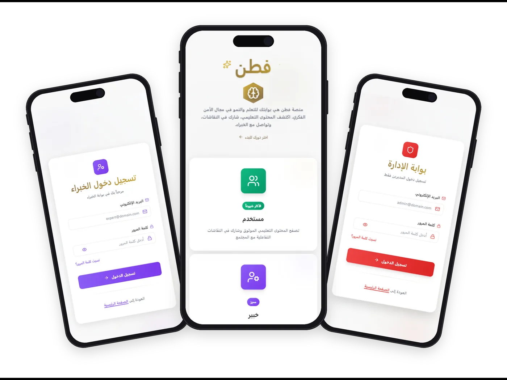

<div align="center">

# Faten — Intellectual Security Platform

**An interactive awareness platform that promotes intellectual security through curated educational content, weekly community discussions, and an AI assistant.**

[](https://github.com/Hashim0011/faten-platform/releases)


<sub>Graduation Project — Software Engineering</sub>



</div>

---

> **فطن — منصة الأمن الفكري:** منصة تفاعلية لتعزيز الأمن الفكري والتوعية من خلال مكتبة محتوى تعليمي، ونقاشات أسبوعية، ومساعد ذكي، مع ثلاثة أدوار (مستخدم، خبير، مشرف) ولوحة تحكم لكل دور.

## Overview

Faten is a full-stack web platform built around three roles — **User**, **Expert**, and **Admin** — each with its own dashboard and permissions. Experts publish educational content and moderate weekly discussions, admins manage users and events, and users learn, discuss, and ask an integrated AI assistant for guidance.

## Features

| Users                               | Experts                         | Admins                  |
| ----------------------------------- | ------------------------------- | ----------------------- |
| Library of books, articles & videos | Publish and manage content      | User & role management  |
| Weekly community discussions        | Create and moderate discussions | Platform-wide dashboard |
| AI assistant chat                   | Delete messages & ban users     | Event management        |
| Notifications, likes, dark mode     | Activity tracking               | Full system control     |

**Platform-wide:** Supabase authentication with OTP two-factor verification · role-based access · real-time data · fully RTL Arabic interface · responsive on every device.

## Tech Stack

| Layer           | Technology                                                     |
| --------------- | -------------------------------------------------------------- |
| Frontend        | React 18, TypeScript, Vite, React Router v6                    |
| Styling         | Tailwind CSS                                                   |
| Backend         | Supabase (PostgreSQL, Auth, Storage)                           |
| AI & Automation | LLM chat assistant, n8n workflows                              |
| Testing         | Vitest, Testing Library, Playwright (E2E)                      |
| Quality         | ESLint, Prettier, Husky, Commitlint, SonarQube, Lighthouse CI  |
| Delivery        | GitHub Actions (CI / CD / Security), semantic-release, Netlify |

## Engineering Practices

- **CI pipeline** — static checks, unit tests with coverage across a Node matrix, production build, and bundle-size analysis on every pull request.
- **Security** — secret scanning (Gitleaks + pre-commit hook), dependency audit, Dependabot updates.
- **Conventional commits** enforced by Commitlint, with automated versioning and changelog via semantic-release.
- **Branch protection** and code owners for reviewed merges.

See [`docs/CICD.md`](docs/CICD.md) for the full pipeline documentation.

## Getting Started

**Prerequisites:** Node.js 18+ and a Supabase project.

```bash
git clone https://github.com/Hashim0011/faten-platform.git
cd faten-platform
npm install
cp .env.example .env   # then fill in your own keys
npm run dev            # http://localhost:5173
```

### Environment Variables

| Variable                 | Description                       |
| ------------------------ | --------------------------------- |
| `VITE_SUPABASE_URL`      | Supabase project URL              |
| `VITE_SUPABASE_ANON_KEY` | Supabase anonymous (public) key   |
| `VITE_OPENAI_API_KEY`    | Key for the AI assistant          |
| `VITE_N8N_WEBHOOK_URL`   | n8n webhook for chatbot workflows |

### Scripts

| Command                 | Description                                   |
| ----------------------- | --------------------------------------------- |
| `npm run dev`           | Start the development server                  |
| `npm run build`         | Production build                              |
| `npm run validate`      | Typecheck, lint, format check, and unit tests |
| `npm test`              | Run unit tests                                |
| `npm run test:e2e`      | Run Playwright end-to-end tests               |
| `npm run test:coverage` | Unit tests with coverage report               |

## Project Structure

```
src/
├── pages/          # Role selection, auth, and User / Expert / Admin dashboards
├── components/     # Modals: AI chat, content details, discussions, notifications
├── lib/            # Supabase data layer: auth, OTP, content, discussions, likes, bans…
├── contexts/       # Toast notifications
└── hooks/          # Theme handling
tests/
├── unit/           # Vitest + Testing Library
└── e2e/            # Playwright
docs/               # CI/CD documentation
```

## Roles & Routes

| Route                                       | Page             |
| ------------------------------------------- | ---------------- |
| `/`                                         | Role selection   |
| `/login` · `/expert-login` · `/admin-login` | Sign in per role |
| `/dashboard`                                | User dashboard   |
| `/expert-dashboard`                         | Expert dashboard |
| `/admin-dashboard`                          | Admin dashboard  |

## Team

- **Hashim Al Masaabi** — [@Hashim0011](https://github.com/Hashim0011)
- **Omar** — [@ommdh98-hub](https://github.com/ommdh98-hub)

## License

© 2025 Faten. All rights reserved.
